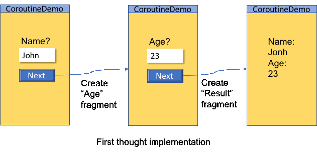

A simple Android APP to demo a coroutine as an alternative to a switch-case state running function

A coroutine can be viewed as a state machine. When it is suspended, it enters a state.
When it is resumed, it run the state transition. Side effects are its output and the state
is maintained by variables in the "stack" of the coroutine, or in other words, the local variables in the
suspend functions along the call stack trace.

This project starts from a plain implementation of Java code, and is refactored to form a switch-case state running function.
And then, the code is converted into Kotlin. At last, a coroutine is used instead of the switch-case function.
Hopefully, it may help to give some intuition to understand Kotlin coroutine.

The scenario to implement
=========================

We choose a very simple scenario for this example. 3 pages are shown one by one.
In the first page, the user enter her name, second page, her age, and the last page
shows the result: the user's name and age.


There are tons of better methods to similar jobs then what's in this example.
However, our purpose is a demo to the similarity betwenn a switch-case function and a coroutine.
So, we choose to bear with our not-so-good implementation.

The first thought implementation
================================

The first thought is to use 3 fragments. The first one has a label for prompt, a edit text for entering the name,
and a button to go to the next step. In the click listener of the button, the next fragment will be brought out...,
and so on until the last fragment is brought out to show the result.



The commit tagged "frag-to-frag" is for this implementation.

When the `MainActivity` is created, three fragments `fragName`, `fragAge`, and `fragResult` will be created.
And the `fragName` is shown right away.

```java
// In MainActivity

    @Override
    protected void onCreate(Bundle savedInstanceState) {
        super.onCreate(savedInstanceState);
        setContentView(R.layout.activity_main);

        fragName = new FragName().setLabel("Your name?");
        fragAge = new FragAge().setLabel("Your age?");
        fragResult = new FragOutput();
        switchToFragment(fragName, "Get Name Fragment.");
    }
```

Once the `Next` button is clicked, it will switch to the `fragAge` fragment.

```java
    public static class FragName extends FragInput {
        @Override
        public void onButtonClicked(String content) {
            getMainActivity().setName(content);
            getMainActivity().switchToFragment(getMainActivity().fragAge, "Get Age Fragment.");
        }

        private MainActivity getMainActivity() {
            return (MainActivity)getActivity();
        }
    }
```

While the button in the `fragAge` fragment is clicked, the `fragResult` will be shown.

```java
    public static class FragAge extends FragInput {
        @Override
        public void onButtonClicked(String content) {
            getMainActivity().setAge(content);
            getMainActivity().fragResult.setLabel("Name: " + getMainActivity().name + ", Age: " + getMainActivity().age);
            getMainActivity().switchToFragment(getMainActivity().fragResult, "Show result");
        }

        private MainActivity getMainActivity() {
            return (MainActivity)getActivity();
        }
    }
```

This implementation is straightforward. But every fragment has to know which is the next fragment that it should bring out.
This is not idea because the logic of transition of UI pages is scattered everywhere and
it is hard to change the logic. We refactor the code and introduce a central state runner to handle the logic in one place.

Use a state machine
===================

Another implementation is the commit tagged as 'stage-runner'.


The upper part of this figure shows a state-chart of the stage runner.
The implementation of this stage runner is by a switch-case function `resume()`.

```java
    enum Stage {
        STAGE_1, STAGE_2, STAGE_3,
    }

    class StageRunner {
        Stage stage = Stage.STAGE_1;
        public <T> void resume(T v) {
            switch (stage) {
                case STAGE_1:
                    switchToFragment(fragName, "Get Name Fragment.");
                    stage = Stage.STAGE_2;
                    break;
                case STAGE_2:
                    setName((String) v);
                    switchToFragment(fragAge, "Get Age Fragment.");
                    stage = Stage.STAGE_3;
                    break;
                default:
                    setAge((String) v);
                    fragResult.setLabel("Name: " + name + ", Age: " + age);
                    switchToFragment(fragResult, "Show result");
                    break;
            }
        }
    }
```

Then, the click listener of the buttons in the fragments can do less things.
Like

```java
    public static class FragName extends FragInput {
        @Override
        public void onButtonClicked(String content) {
            getMainActivity().runner.resume(content);
        }

        private MainActivity getMainActivity() {
            return (MainActivity)getActivity();
        }
    }

    public static class FragAge extends FragInput {
        @Override
        public void onButtonClicked(String content) {
            getMainActivity().runner.resume(content);
        }

        private MainActivity getMainActivity() {
            return (MainActivity)getActivity();
        }
    }
```

It can just call `StageRunner.resume()` with the result it got and the
stage runner will handle the data processing and UI page transition.

This frees fragments from the responsibility of data processing and UI page transition.
The fragments will get more re-usability. We have also more flexibility to adjust
the UI page transition. We need only to rewrite the stage runner to have a new behaviour.

However, a switch-case is not so good to read and modify.
We have a better alternative: the Kotlin Coroutine.

Use Kotlin Coroutine
====================

The implementation is at the commit tagged 'kotlin-coroutine'. The `MainActivity.java` exists no more.
It has be converted to `MainActivity.kt` before being refactored to use a Kotlin Coroutine, instead of
the stage runner state machine.

If you are not familiar with the syntax of Kotlin, you may want to take
a look at the commit "Converted to Kotlin code." and compare with the
Java code of its previous commit. They should be line-to-line equivalent
because the conversion was carried out by the IDE.


The difference of this figure from last one is obvious. A sequence chart is used instead of the state chart.

Let me say it boldly. A coroutine is essentially a switch-case function,
almost. Not exactly the same of course because a coroutine has its own
stack apart from a normal thread to keep things through suspensions and
continuations.

We can compare the code of a coroutine to the code of a stage runner.

```kotlin
    private suspend fun coRunner() {
        Log.v(TAG, "Before getting name.")
        val name = suspendCoroutine<String> {
            cont -> contGetName = cont
            switchToFragment(fragName, "Get Name Fragment.")
        }
        Log.v(TAG, "Before getting age.")
        val age = suspendCoroutine<String> {
            cont -> contGetAge = cont
            switchToFragment(fragAge, "Get Age Fragment.")
        }
        Log.v(TAG, "Before showing results.")
        fragResult!!.setLabel("Name: $name, Age: $age")
        switchToFragment(fragResult, "Show result")
    }
```

It does the same thing as the stage runner did, in a linear manner. If
we want to change the order of querying to "age first and then name", we
just rearrange the order of the code. No bother to set the `stage`
variable manually as we have to do in the stage runner. Any flow
control, `if-else`, `for`, `while`, and etc... can be used and you get a
state machine immediately.

One may notice that the `name` and `age` can be kept on "local"
variables in a coroutine. This is neat and convenient.
 
Now let's take a closer look at details of the coroutine.

Start of a coroutine
====================

Depending on what dispatcher is used, a coroutine may be run by a thread
of threads in various way. To focus, we will just discuss the dispatcher
`Dispatcher.Main`. It behaviour is similar to a `Handler` of the Main
thread. The code to start the coroutine is

```kotlin
        suspend {
            Log.v(TAG, "Already in the coroutine. Now in thread ${Thread.currentThread()}")
            coRunner()
        }.startCoroutine(complete)
```

Maybe we can see it as a `post` on the main thread handler as if

```kotlin
        Handler().post {
            Log.v(TAG, "Already in the coroutine. Now in thread ${Thread.currentThread()}")
            coRunner()
        }

```

The difference is that `startCoroutine()` takes a `suspend` function,
instead. When a suspend function is suspended, the control is returned
to the message loop of the thread, in my best guess.

Generally we do not have to use so primitive a function
`startCoroutine()`. We can use constructs such as `launch`, `async`, or
`runBlocking`. We use `startCoroutine()` just because this is a demo.

The `startCoroutine()` take a lambda to run. In our case, it outputs a
log message and call the suspend function `coRunner()`.
 
Some log messages have been added in the code for convenience to trace
the execution flow.

```
> After starting the coroutine. Now in thread Thread[main,5,main]
> Already in the coroutine. Now in thread Thread[main,5,main]
> Before getting name.
> The name is gotten.
> Before getting age.
> The age is gotten.
> Before showing results.
```

The `startCoroutine()` takes another argument of the type
`Continuation<T>`. The one used here is

```kotlin
        val complete = object: Continuation<Unit> {
            override val context: CoroutineContext
                get() = Dispatchers.Main

            override fun resumeWith(result: Result<Unit>) {
                Log.v(TAG, "The coroutine completed.")
                if (result.isFailure) {
                    result.exceptionOrNull()?.apply { throw this }
                            ?: throw RuntimeException("Suspend function failure.")
                }
            }
        }
```

In the class the dispatcher to be used is assigned. The `resumeWith()`
is a callback function invoked when the coroutine exits for some reason.
We can get the return value or the thrown exception of the coroutine
from the argument `result` if any.

Suspend and resume
==================

A coroutine supends by calling `suspendCoroutine<T>()`, defined as

```
public suspend inline fun <T> suspendCoroutine(crossinline block: (Continuation<T>) -> Unit): T =
```

This function takes a lambda function, runs it, and then suspends.
No return until resumed in a way we are going to talk about before soon.

In our code
 
```
        val name = suspendCoroutine<String> {
            cont -> contGetName = cont
            switchToFragment(fragName, "Get Name Fragment.")
        }
```
 
It calls the lambda function with an argument of the type
`Continuation<T>`, which is `Continuation<String>` in our case, because
we are using `suspendCoroutine<String>`

In the lambda function, we save the argument `cont` somewhere safe, that
is `contGetName`. And then, the `fragName` fragment is brought out.
Then, the coroutine suspends and returns to the message looper of the
Main thread. (Again, this depends on the implementation of the
dispatcher.)

In the click listener of the "Next" button of the UI, the
`doneGetName()` function is called.

```
    fun doneGetName(name: String) {
        Log.v(TAG, "The name is gotten.")
        contGetName!!.apply {
            contGetName = null
            resume(name)
        }
    }
```

It calls the `resume(name)` method (let's assume `name == "John"`) on
the `contGetName` object that we saved earlier and then, the
`suspendCoroutine()` returns a string "John". The coroutine is back
alive.

The end of the coroutine
========================

Along the code flow of a coroutine, it may suspends and be resumed many
times. No limit. And maybe finally, it returns.

Or maybe it throws some exception and exits.

Anyway, the `resumeWith()` method will be call on the object that is
given to the `startCoroutine` function


Summary
=======

* This is not a tutorial of Kotlin Coroutine. Just an example that shows
  a view point from a perspective. It is just a tip of the iceberg.
  
* Coroutine can be viewed as a state machine that can be implemented by
  a linear code flow.

* Going further. Many about coroutine are there to learn. Such as
  Dispatcher, Job, CoroutineContext.

* Many good functions has been implemented with Coroutine. Such as
  async/await, generator,... etc.


